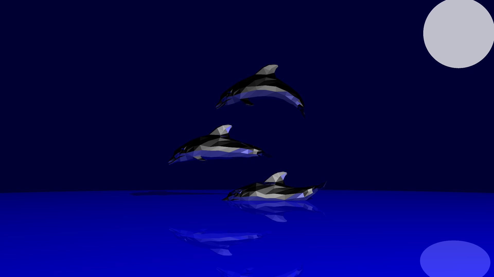

A basic 3D raytracer.

It uses [our teacher's framework](https://github.com/mhe/raytracerframework_cpp) and is still a work in progress.

Current features include flexible scene definition, multiple light sources (with shadows), material definitions, SSAA, reflections, depth of field, tone mapping and import of meshes

